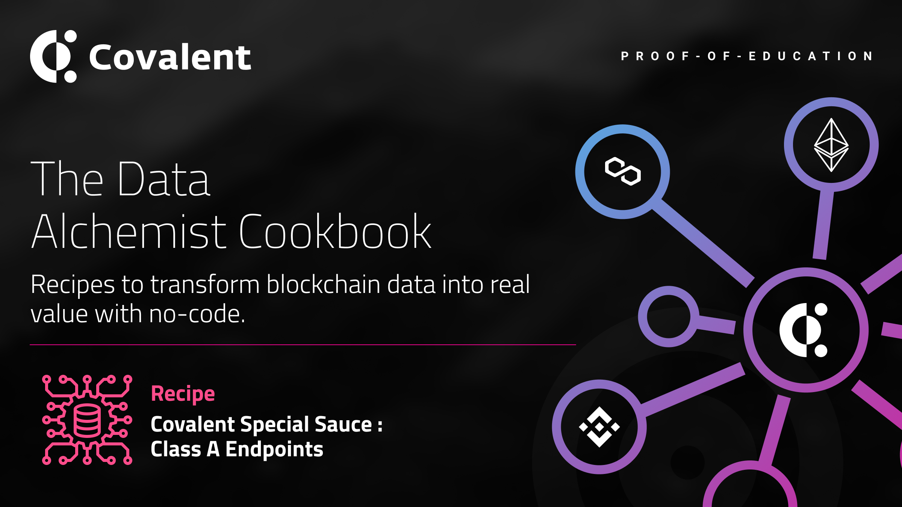

# Title

<Aside>

**Outcome:** Learn how to ....

</Aside>

&nbsp;
## Introduction

Intro blurb

### Prerequisites

<Aside>

Using the Covalent API can begin as soon as you create an account, and requires two steps:

1. [Obtain your API key](https://www.covalenthq.com/platform/#/auth/register) so Covalent can authenticate your API requests

2. [Test your API key](https://www.covalenthq.com/docs/api/) directly from our docs to confirm your key is set up correctly

</Aside>

## Endpoints Summary:

The key Covalent API endpoints covered are:

<Definitions>

- `v1/{chain_id}/address/{address}/balances_v2/`
  - Get token balances for `address`. Return a list of all ERC20 and NFT token balances including ERC721 and ERC1155 along with their current spot prices.

    <TableWrap>

    Parameter|Default|Description
    ---|---|---
    |`nft`|false|When this is set to `true`, the response returns ERC721 and ERC1155 tokens as well|
    |`no-nft-fetch`|false|When this is set to `true`, the response does not return the metadata associated with each NFT.|

    </TableWrap>

- `v1/{chain_id}/address/{address}/transactions_v2/`
  - For a given `address`, return the transactions involved with it. The transactions are returned alongwith the decoded log events. If you specify a NFT contract for the `address`, the log event will contain the `token_id`s being moved around.

    <TableWrap>

    Parameter|Default|Description
    ---|---|---
    |`nft`|false|When this is set to `true`, the response returns ERC721 and ERC1155 tokens as well|
    |`no-nft-fetch`|false|When this is set to `true`, the response does not return the metadata associated with each NFT.|

    </TableWrap>
  
- `v1/{chain_id}/tokens/{contract_address}/nft_metadata/{token_id}/`
  - Given a NFT contract at `contract_address` and a `token_id`, fetch the external metadata along with their owners.

    <TableWrap>

    Parameter|Default|Description
    ---|---|---
    |`nft`|false|When this is set to `true`, the response returns ERC721 and ERC1155 tokens as well|
    |`no-nft-fetch`|false|When this is set to `true`, the response does not return the metadata associated with each NFT.|

    </TableWrap>

</Definitions>

## Content

Add json content in like this:

```json
---
header: Query to include all records
---
{
    {
    "field_1": "value_1"
}
}
```

Add csv content in like this:

```csv
---
header: Query to include all records
---
1,2,3,4,5
```


## Summary

### Next Steps
(if applicable)
